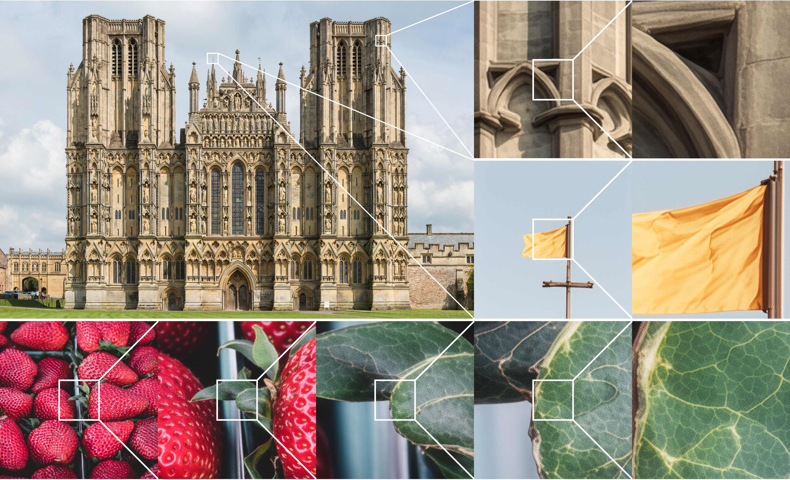

# Chain-of-Zoom: Extreme Super-Resolution via Scale Autoregression and Preference Alignment

This repository is the official implementation of [Chain-of-Zoom: Extreme Super-Resolution via Scale Autoregression and Preference Alignment](https://arxiv.org/abs/2505.18600), led by

[Bryan Sangwoo Kim](https://scholar.google.com/citations?user=ndWU-84AAAAJ&hl=en), [Jeongsol Kim](https://jeongsol.dev/), [Jong Chul Ye](https://bispl.weebly.com/professor.html)



[](https://bryanswkim.github.io/chain-of-zoom.github.io/)
[](https://arxiv.org/abs/2505.18600)

---
## 🔥 Summary

Modern single-image super-resolution (SISR) models deliver photo-realistic results at the scale factors on which they are trained, but show notable drawbacks:

1. **Blur and artifacts** when pushed to magnify beyond its training regime
2. **High computational costs and inefficiency** of retraining models when we want to magnify further

This brings us to the fundamental question: \
_How can we effectively utilize super-resolution models to explore much higher resolutions than they were originally trained for?_

We address this via **Chain-of-Zoom** 🔎, a model-agnostic framework that factorizes SISR into an autoregressive chain of intermediate scale-states with multi-scale-aware prompts.
CoZ repeatedly re-uses a backbone SR model, decomposing the conditional probability into tractable sub-problems to achieve extreme resolutions without additional training.
Because visual cues diminish at high magnifications, we augment each zoom step with multi-scale-aware text prompts generated by a prompt extractor VLM.
This prompt extractor can be fine-tuned through GRPO with a critic VLM to further align text guidance towards human preference.

## 🗓 ️News
- [May 2025] Code and paper are uploaded.

## 🛠️ Setup
First, create your environment. We recommend using the following commands. 

```
git clone https://github.com/bryanswkim/Chain-of-Zoom.git
cd Chain-of-Zoom

conda create -n coz python=3.10
conda activate coz
pip install -r requirements.txt
```

## ⏳ Models

|Models|Checkpoints|
|:---------|:--------|
|Stable Diffusion v3|[Hugging Face](https://huggingface.co/stabilityai/stable-diffusion-3-medium)
|Qwen2.5-VL-3B-Instruct|[Hugging Face](https://huggingface.co/Qwen/Qwen2.5-VL-3B-Instruct)
|RAM|[Hugging Face](https://huggingface.co/spaces/xinyu1205/recognize-anything/blob/main/ram_swin_large_14m.pth)

## 🌄 Example
You can quickly check the results of using **CoZ** with the following example:
```
python inference_coz.py \
  -i samples \
  -o inference_results/coz_vlmprompt \
  --rec_type recursive_multiscale \
  --prompt_type vlm \
  --lora_path ckpt/SR_LoRA/model_20001.pkl \
  --vae_path ckpt/SR_VAE/vae_encoder_20001.pt \
  --pretrained_model_name_or_path 'stabilityai/stable-diffusion-3-medium-diffusers' \
  --ram_ft_path ckpt/DAPE/DAPE.pth \
  --ram_path ckpt/RAM/ram_swin_large_14m.pth \
```
Which will give a result like below:


## 🔬 Efficient Memory
Using ```--efficient_memory``` allows CoZ to run on a single GPU with 24GB VRAM, but highly increases inference time due to offloading. \
We recommend using two GPUs.

## 🤗 Acknowledgements
We thank the authors of [OSEDiff](https://github.com/cswry/OSEDiff) for sharing their awesome work!

> [!note]
> This work is currently in the preprint stage, and there may be some changes to the code.
